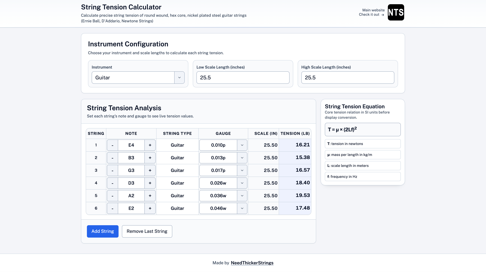

<h1 align="center">🎸 String Tension Calculator</h1>

<p align="center">
  A modern string tension calculator for hex core, nickel-plated steel guitar strings.<br>
  Built with Vue.js, Vite, and Tailwind.
</p>

<p align="center">
  <a href="https://stringtensioncalculator.netlify.app"><strong>🔗 Live Demo</strong></a>
</p>

---

## 📚 Table of Contents

- [Preview](#-preview)
- [Live Website](#-live-website)
- [Features](#-features)
- [Getting Started](#-getting-started)
- [Scripts](#-scripts)
- [Built With](#-built-with)
- [Author](#-author)
- [Contributing](#-contributing)
- [Support](#-support)
- [License](#-license)
- [Trademark Disclaimer](#-trademark-disclaimer)

---

## 📸 Preview

<p align="center">
  
</p>

---

## 🌐 Live Website

👉 https://stringtensioncalculator.netlify.app

---

## ✨ Features

- Calculate string tension based on:
  - Gauge
  - Scale length
  - Tuning
- Clean and responsive UI
- Fast performance with Vite
- Lightweight and easy to use

---

## 🚀 Getting Started

Clone the repository:

```bash
git clone git@github.com:jacobrees/String-Tension-Calculator.git
```

Navigate into the project:

```bash
cd String-Tension-Calculator
```

Install dependencies:

```bash
npm install
```

Run the development server:

```bash
npm run dev
```

---

## 🛠 Scripts

| Command | Description |
|--------|------------|
| `npm install` | Install dependencies |
| `npm run dev` | Start development server |
| `npm run build` | Build for production |

---

## 🧱 Built With

- Vue.js
- Tailwind CSS
- Vite

---

## 👤 Author

**Jacob Rees**

- GitHub: https://github.com/jacobrees  
- LinkedIn: https://www.linkedin.com/in/jacob-rees/

---

## 🤝 Contributing

Contributions, issues, and feature requests are welcome.

---

## ⭐ Support

If you found this project useful, consider giving it a star.

---

## 📄 License

This project is licensed under the MIT License.  
See the [LICENSE](LICENSE) file for details.

---

## ⚖️ Trademark Disclaimer

All product names, trademarks, and brand names (including but not limited to Ernie Ball, D’Addario, etc.) are the property of their respective owners.

They are used for identification and reference purposes only and do not imply any affiliation with or endorsement by the respective trademark holders.
